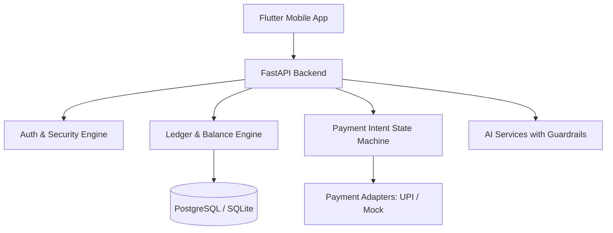

# MoneyFlow AI System Architecture

## Overview
MoneyFlow AI acts as a personal financial ledger, payment intent manager, and AI financial assistant.
It tracks opening & current balances, records payment reasons before initiating transfers, auto-categorizes transactions with AI guardrails, detects anomalies, and supports voice transactions & receipt scanning.

## System Architecture Diagram
